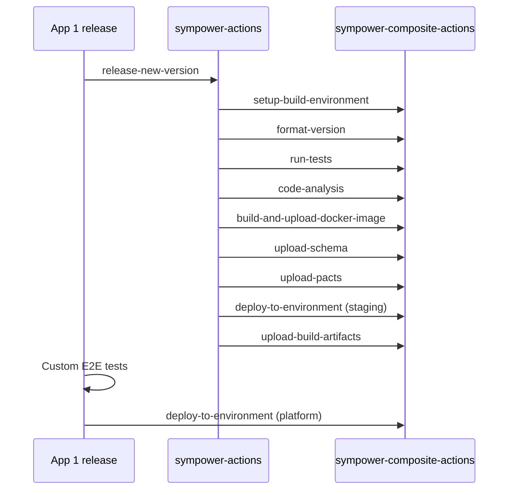
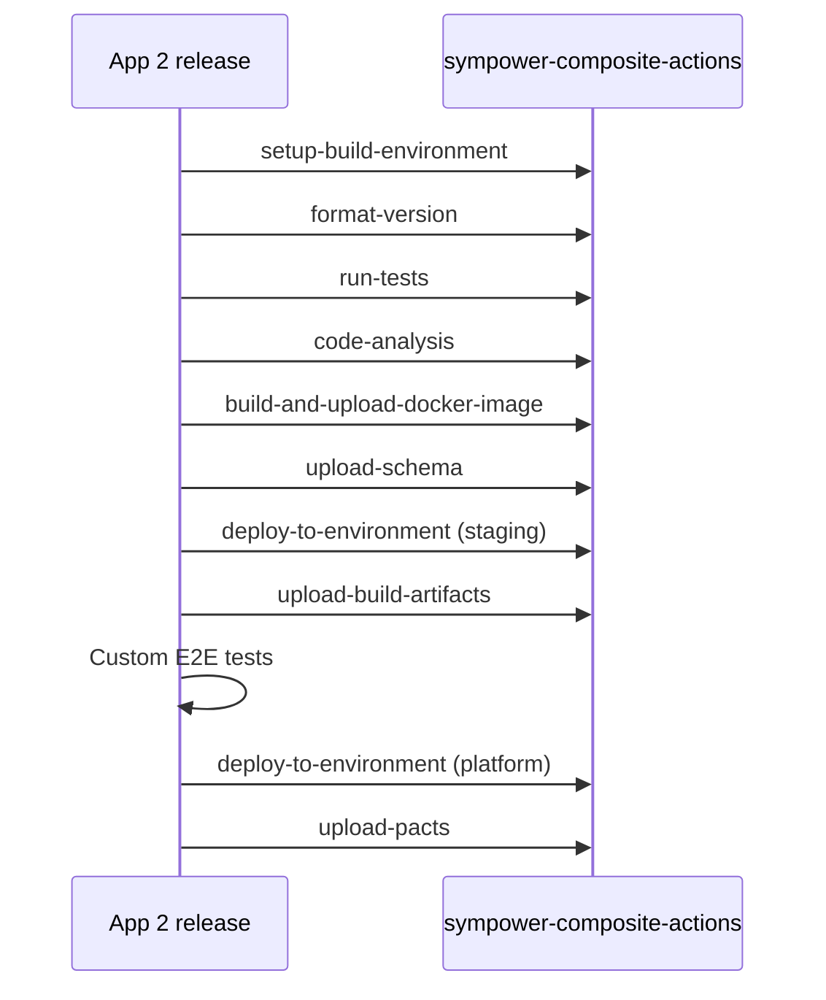

# Sympower Common Workflows

This repository contains Sympower's default reusable GitHub workflows to be called/reused by the workflows of each
individual repository.

## Included workflows

### build-and-push-docker-image

The `General Build and Push Docker Images to ECR (buildx)` workflow facilitates
the automation of Docker image creation and deployment to AWS ECR.

#### Inputs

- **aws_region**: The AWS region where the ECR is located. This is necessary for
configuring the AWS environment and logging into the ECR.
- **image_name**: The name of the Docker image to be pushed to ECR.
- **image_tag**: The tag for the Docker image being pushed.
- **context_path**: The build context path for Docker. This is the path where
the Docker build context resides, typically where your Dockerfile and related
files are located.
- **dockerfile_path**: The path to the Dockerfile. This should point to the
Dockerfile in the build context directory.

### Example of Use
```yaml
name: Deploy to AWS ECR

on: [push, pull_request]

jobs:
  build-and-push:
    uses: sympower/sympower-actions/.github/workflows/build-and-push-docker-image.yml@{LATEST_VERSION}
    secrets: inherit
    with:
      aws_region: 'eu-central-1'
      image_name: 'my-application'
      image_tag: 'latest'
      context_path: '.'
      dockerfile_path: 'Dockerfile'
```

### release-new-version

`release-new-version` is meant as default workflow that builds, tests, analyses a Java/Kotlin Gradle project and
publishes all the relevant artifact, Docker images, pact contracts etc. This workflow is aware whether it is
operating on main/master branch or on some development branch. If the branch is not main/master, then the workflow will
not publish any release artifacts.

This workflow calls following composite actions:
* [setup-build-environment](https://github.com/sympower/sympower-composite-actions/blob/main/README.md#setup-build-environment)
* [format-version](https://github.com/sympower/sympower-composite-actions/blob/main/README.md#format-version)
* [run-tests](https://github.com/sympower/sympower-composite-actions/blob/main/README.md#run-tests)
* [code-analysis](https://github.com/sympower/sympower-composite-actions/blob/main/README.md#code-analysis)
* on main/master branches:
  * [build-and-upload-docker-image](https://github.com/sympower/sympower-composite-actions/blob/main/README.md#build-and-upload-docker-image)
  * [upload-schema](https://github.com/sympower/sympower-composite-actions/blob/main/README.md#upload-schema)
  * [upload-pacts](https://github.com/sympower/sympower-composite-actions/blob/main/README.md#upload-pacts)
  * [deploy-to-environment](https://github.com/sympower/sympower-composite-actions/blob/main/README.md#deploy-to-environment)
    for `staging` environment
* always: [upload-build-artifacts](https://github.com/sympower/sympower-composite-actions/blob/main/README.md#upload-build-artifacts)


Example of use:
```yaml
name: Release new version

on:
  push:
    paths-ignore:
      - '**/README.md'
  workflow_dispatch:

jobs:
  release-new-version:
    name: "Release new version"
    uses: sympower/sympower-actions/.github/workflows/release-new-version.yml@{LATEST_VERSION}
    with:
      gistID: {some-gist-id}
    secrets: inherit
```

### release-for-testing

`release-for-testing` is meant as default workflow that builds, test, analyses a Java/Kotlin Gradle project and upload
schema artifact and Docker image without checking if the branch is main/master or not. This workflow is meant to be used
for manually publishing testing images and schemas.

This workflow calls following composite actions:
* [setup-build-environment](https://github.com/sympower/sympower-composite-actions/blob/main/README.md#setup-build-environment)
* [format-version](https://github.com/sympower/sympower-composite-actions/blob/main/README.md#format-version)
* [run-tests](https://github.com/sympower/sympower-composite-actions/blob/main/README.md#run-tests)
* [code-analysis](https://github.com/sympower/sympower-composite-actions/blob/main/README.md#code-analysis)
* [build-and-upload-docker-image](https://github.com/sympower/sympower-composite-actions/blob/main/README.md#build-and-upload-docker-image)
* [upload-schema](https://github.com/sympower/sympower-composite-actions/blob/main/README.md#upload-schema)
* always: [upload-build-artifacts](https://github.com/sympower/sympower-composite-actions/blob/main/README.md#upload-build-artifacts)

Example of use:
```yaml
name: Release for testing

on: workflow_dispatch

jobs:
  release-for-testing:
    name: "Release for testing"
    uses: sympower/sympower-actions/.github/workflows/release-for-testing.yml@{LATEST_VERSION}
    secrets: inherit
```

## Customizing workflows

There are two main approaches to customize the workflows:
* [Extending the default workflow](#extending-the-default-workflow)
* [Fully custom workflow](#fully-custom-workflow)

### Extending the default workflow

It is possible to add additional job(s) to your workflow. These jobs can declare that they depend on the default
workflow with `needs` field like this:

```yaml
jobs:
  release-new-version:
    name: "Release new version"
    uses: sympower/sympower-actions/.github/workflows/release-new-version.yml@{LATEST_VERSION}
    with:
      gistID: {some-gist-id}
    secrets: inherit

  custom-job:
    name: "Custom Job"
    runs-on: ubuntu-latest
    needs: release-new-version
    # Use if you need it to run only on main/master branch and take out either master or main depending on your default
    # branch.
    # if: contains('refs/heads/main, refs/heads/master', github.ref)
    steps:
      # ..
      - run: # ...
      # ...
      - id: some-composite-action-use
        name: "Use some composite action"
        uses: sympower/sympower-composite-actions/{COMPOSITE_ACTION_NAME}@{LATEST_VERSION}
      # ...
```

For example, if custom E2E/system test and deployment to Platform (production) composite actions steps were attached
like this, then the workflow would make calls like this:



This approach is more static and slower since new job needs to be spawned for customization. However, it will require
less upkeep when the composite actions and/or default workflows are updated.

### Fully custom workflow

It is possible to call the composite actions directly. Simplest approach is to copy the whole
[release-new-version.yml](.github/workflows/release-new-version.yml) to your repository and modify it to your needs.

For example if custom E2E/system test and deployment to Platform (production) composite actions steps were injected
between other steps and `upload-pacts` step has been moved to make sure that the Pact contract is not enforced before
production version is upgraded, then the workflow would make calls like this:



Directly calling composite actions will give more freedom to rearrange the workflow steps and will ensure that all steps
run in the same job and a runner which is faster and more optimal. However, this approach will require more upkeep
when the composite actions are updated.
